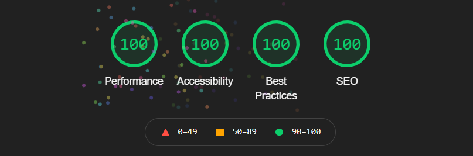

# Spili

spili it's an opinioneted Static blog generator, starting a blog has never been so easy! it cames out of the box with:

- a responsive template
- a powerfull cli
- a live server with hot reload

## Getting started

### install

`npm install -g spili`

### inizialize a new blog

`spili new <your-blog-name>`

## start the project

start a local server with hot Reaload
`cd <your-blog-name> && spili serve`

default port is: 3333 but you can use any port, simply specify the port after serve

`spili serve 8080`

## crate an article

`spili article "<Name of the Article>"`

---

## build the blog

`spili build`

---

# this is an alpha version
